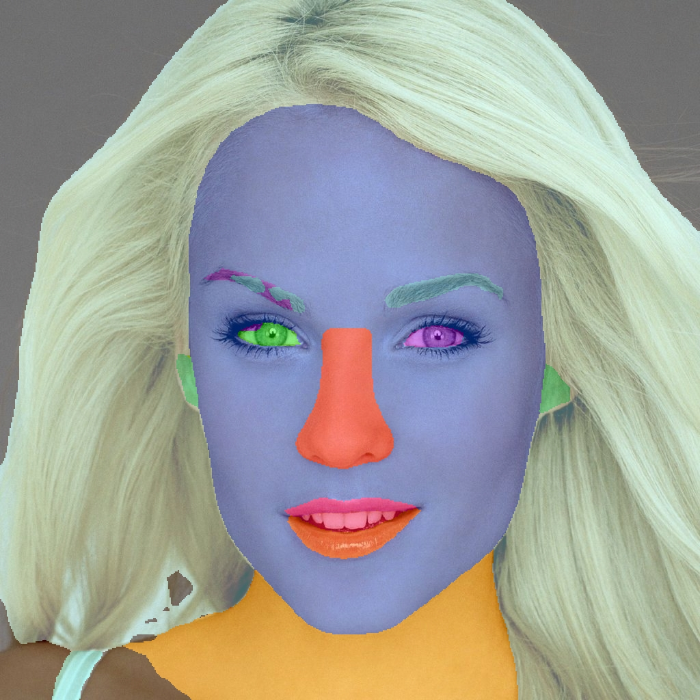

# BiSeNet: Bilateral Segmentation Network for Real-time Semantic Segmentation

 
[](https://github.com/yakhyo/face-parsing/stargazers)
[](https://opensource.org/licenses/MIT) 
[](https://github.com/yakhyo/face-parsing)


This is a face parsing model for high-precision facial feature segmentation based on [BiSeNet: Bilateral Segmentation Network for Real-time Semantic Segmentation](https://arxiv.org/abs/1808.00897). This model accurately segments various facial components such as the eyes, nose, mouth, and the contour of the face from images. This repo provides a different training & inference code and new backbone model has been added.

<table>
  <tr>
    <td style="text-align: left;"><p>Input Images</p></td>
    <td style="text-align: center;"></td>
    <td style="text-align: center;"></td>
    <td style="text-align: center;"></td>
    <td style="text-align: center;"></td>
  </tr>
  <tr>
    <td style="text-align: left;"><p>ResNet34</p></td>
    <td style="text-align: center;"></td>
    <td style="text-align: center;"></td>
    <td style="text-align: center;"></td>
    <td style="text-align: center;"></td>
  </tr>
  <tr>
    <td style="text-align: left;"><p>ResNet18</p></td>
    <td style="text-align: center;"></td>
    <td style="text-align: center;"></td>
    <td style="text-align: center;"></td>
    <td style="text-align: center;"></td>
  </tr>
</table>


## Table of Contents

- [Project Description](#project-description)
- [Installation](#installation)
- [Usage](#usage)
- [Contributing](#contributing)
- [License](#license)

## Project Description

Face parsing model segments facial features with remarkable accuracy, making it ideal for applications in digital
makeup, augmented reality, facial recognition, and emotion detection. The model processes input images and outputs a
detailed mask that highlights individual facial components, distinguishing between skin, hair, eyes, and other key
facial landmarks.

Following updates have been made so far:

- [x] Prepared more clear training code
- [x] Updated backbone models, added resnet34 model (initially it has only resnet18)
- [x] Trained model weights/checkpoints with different backbones on [Github Release](https://github.com/yakhyo/face-parsing/releases/tag/v0.0.1)
- [x] Made several auxiliary updates to the code.
- [x] torch to onnx convert
- [x] onnx inference

## Installation

To get started with the Face Parsing Model, clone this repository and install the required dependencies:

```commandline
git clone https://github.com/yakhyo/face-parsing.git
cd face-parsing-model
pip install -r requirements.txt
```

## Usage
#### Download weights (click to download):

| Model    | PT                                                                                   | ONNX                                                                                 |
|----------|--------------------------------------------------------------------------------------|--------------------------------------------------------------------------------------|
| ResNet18 | [resnet18.pt](https://github.com/yakhyo/face-parsing/releases/download/v0.0.1/resnet18.pt) | [resnet18.onnx](https://github.com/yakhyo/face-parsing/releases/download/v0.0.1/resnet18.onnx) |
| ResNet34 | [resnet34.pt](https://github.com/yakhyo/face-parsing/releases/download/v0.0.1/resnet34.pt) | [resnet34.onnx](https://github.com/yakhyo/face-parsing/releases/download/v0.0.1/resnet34.onnx) |

#### Run below code to download all weights under `weights` folder
```bash
sh download.sh
```
### Train

Training Arguments:

```
usage: train.py [-h] [--num-classes NUM_CLASSES] [--batch-size BATCH_SIZE] [--num-workers NUM_WORKERS] [--image-size IMAGE_SIZE IMAGE_SIZE] [--data-root DATA_ROOT] [--momentum MOMENTUM] [--weight-decay WEIGHT_DECAY] [--lr-start LR_START]
                [--max-iter MAX_ITER] [--power POWER] [--lr-warmup-epochs LR_WARMUP_EPOCHS] [--warmup-start-lr WARMUP_START_LR] [--score-thres SCORE_THRES] [--epochs EPOCHS] [--backbone BACKBONE] [--print-freq PRINT_FREQ] [--resume]

Argument Parser for Training Configuration

options:
  -h, --help            show this help message and exit
  --num-classes NUM_CLASSES
                        Number of classes in the dataset
  --batch-size BATCH_SIZE
                        Batch size for training
  --num-workers NUM_WORKERS
                        Number of workers for data loading
  --image-size IMAGE_SIZE IMAGE_SIZE
                        Size of input images
  --data-root DATA_ROOT
                        Root directory of the dataset
  --momentum MOMENTUM   Momentum for optimizer
  --weight-decay WEIGHT_DECAY
                        Weight decay for optimizer
  --lr-start LR_START   Initial learning rate
  --max-iter MAX_ITER   Maximum number of iterations
  --power POWER         Power for learning rate policy
  --lr-warmup-epochs LR_WARMUP_EPOCHS
                        Number of warmup epochs
  --warmup-start-lr WARMUP_START_LR
                        Warmup starting learning rate
  --score-thres SCORE_THRES
                        Score threshold
  --epochs EPOCHS       Number of epochs for training
  --backbone BACKBONE   Backbone architecture
  --print-freq PRINT_FREQ
                        Print frequency during training
  --resume              Resume training from checkpoint

```

```commandline
python train.py
```

### PyTorch Inference

PyTorch Inference Arguments:

```
usage: inference.py [-h] [--model MODEL] [--weight WEIGHT] [--input INPUT] [--output OUTPUT]

Face parsing inference

options:
  -h, --help       show this help message and exit
  --model MODEL    model name, i.e resnet18, resnet34
  --weight WEIGHT  path to trained model, i.e resnet18/34
  --input INPUT    path to an image or a folder of images
  --output OUTPUT  path to save model outputs

```

PyTorch inference example:
```
python inference.py --model resnet18 --weights ./weights/resnet18.pt --input assets/images --output assets/results
```

### ONNX Inference
ONNX inference arguments:
```
usage: onnx_inference.py [-h] [--onnx-weight ONNX_WEIGHT] [--input INPUT] [--output OUTPUT]

Face parsing ONNX inference

options:
  -h, --help            show this help message and exit
  --onnx-weight ONNX_WEIGHT
                        path to onnx model, default './weights/resnet18.onnx'
  --input INPUT         path to an image or a folder of images
  --output OUTPUT       path to save model outputs
```

ONNX inference example:
```
python onnx_inference.py --onnx-weight ./weights/resnet18.onnx --input ./assets/images --output ./assets/results/resnet18onnx
```

## Contributing

Contributions to improve the Face Parsing Model are welcome. Feel free to fork the repository and submit pull requests,
or open issues to suggest features or report bugs.

## License

The project is licensed under the [MIT license](https://opensource.org/license/mit/).

## Citation

```
@misc{face-parsing,
  author = {Valikhujaev Yakhyokhuja},
  title = {face-parsing},
  year = {2024},
  publisher = {GitHub},
  howpublished = {\url{https://github.com/yakhyo/face-parsing}},
  note = {GitHub repository}
}

```

## Reference

The project is built on top of [face-parsing.PyTorch](https://github.com/zllrunning/face-parsing.PyTorch). Model architecture and training strategy have been re-written for better performance. 

<!--
## Star History

[](https://star-history.com/#yakhyo/face-parsing&Date) 
-->
